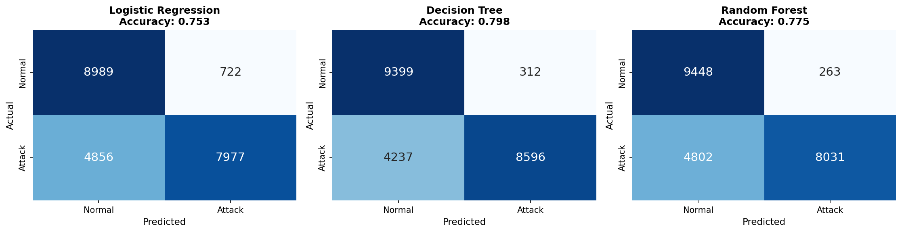
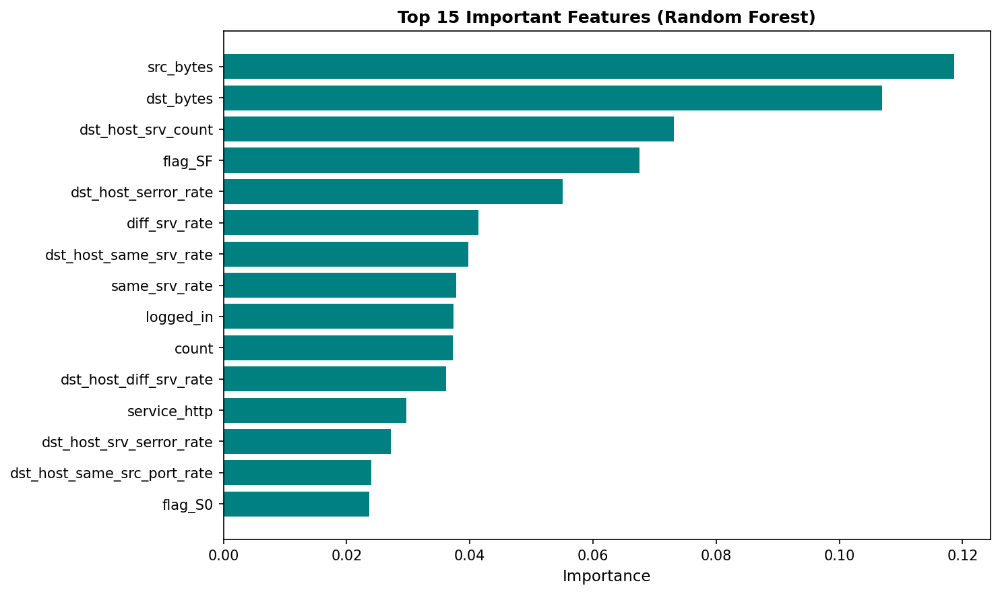

# Machine Learning Intrusion Detection System
*Binary Classification on NSL-KDD Dataset*

## Overview

This project compares three machine learning models for network intrusion detection to identify the optimal balance between accuracy and computational efficiency for practical deployment. We evaluate **Logistic Regression**, **Decision Tree**, and **Random Forest** on the NSL-KDD dataset.

## Problem Statement

Traditional signature-based Intrusion Detection Systems (IDS) like Snort suffer from high false positive rates and struggle with zero-day attacks. This project demonstrates how machine learning models trained on historical network traffic data can complement rule-based systems for more robust threat detection.

## Dataset

**NSL-KDD** is an improved version of the KDD'99 dataset, widely used in intrusion detection research. It contains:
- **125,973 training samples**
- **22,544 test samples**
- **41 features** describing network connections (protocol type, service, flag, byte counts, error rates, etc.)
- **Binary classification:** Normal traffic vs. Attack traffic

The dataset addresses class imbalance and redundancy issues present in KDD'99, making it more suitable for realistic evaluation.

## Approach

### Preprocessing
1. **Binary Classification:** Converted multi-class labels to binary (normal = 0, attack = 1)
2. **One-Hot Encoding:** Categorical features (protocol_type, service, flag)
3. **Feature Scaling:** StandardScaler for numeric features
4. **Final Feature Space:** 119 dimensions after encoding

### Models Evaluated
- **Logistic Regression:** Linear baseline model for comparison
- **Decision Tree:** Non-linear, interpretable model with feature importance
- **Random Forest:** Ensemble method (100 trees) for improved generalization

All models use default scikit-learn parameters and are trained on the full training set.

## Results

| Model | Accuracy | Precision | Recall | F1-Score | Training Time |
|-------|----------|-----------|--------|----------|---------------|
| **Decision Tree** | **79.8%** | **96.5%** | **67.0%** | **79.1%** | **1.7s** |
| Random Forest | 77.5% | 96.8% | 62.6% | 76.0% | 9.9s |
| Logistic Regression | 75.3% | 91.7% | 62.2% | 74.1% | 14.7s |

### Key Findings

#### Winner: Decision Tree
- **Best overall accuracy** (79.8%) and F1-score (79.1%)
- **Fastest training** (1.7s - 6x faster than Random Forest)
- **High precision** (96.5%) minimizes false alarms
- **Interpretable** structure allows security analysts to understand detection logic

#### Precision vs. Recall Trade-off
All models achieved **>91% precision** but moderate recall (~62-67%), indicating:
- Models are **conservative** - only flag traffic as malicious when highly confident
- May miss ~33% of sophisticated attacks (trade-off for low false positives)
- Well-suited for environments where false alarms are costly

#### Training Efficiency
- Decision Tree trains **6x faster** than Random Forest
- All models train in **<15 seconds** on full NSL-KDD dataset
- Feasible for periodic retraining with updated threat data

## Confusion Matrices

The confusion matrices show strong performance on normal traffic classification, with most errors occurring in the false negative category (attacks classified as normal). This aligns with the high precision/moderate recall pattern.

## Feature Importance

The Random Forest model identifies the most discriminative features for attack detection, with connection statistics (dst_host_srv_count, srv_count) and error rates being highly predictive.

## Quick Start

### Run in Google Colab

## Real-World Application

This project demonstrates a **practical framework** for:
1. **Model Selection:** Comparing multiple algorithms with consistent evaluation
2. **Resource-Constrained Deployment:** Balancing accuracy vs. speed for small organizations
3. **Baseline Establishment:** Decision Tree provides a strong, interpretable baseline for more complex architectures

**Future Extensions:**
- Integration with Snort for hybrid signature-based + ML detection
- Real-time inference pipeline for live network traffic
- Adversarial robustness testing
- Multi-class attack type classification

## Limitations

- **Moderate Recall:** May miss ~33% of attacks in favor of low false positives
- **Synthetic Dataset:** NSL-KDD is derived from simulated network traffic; real-world performance may vary
- **Static Models:** No online learning or adaptation to evolving attack patterns

## References

- [NSL-KDD Dataset Documentation](https://www.unb.ca/cic/datasets/nsl.html)
- [M. Tavallaee, E. Bagheri, W. Lu and A. A. Ghorbani, "A detailed analysis of the KDD CUP 99 data set," 2009 IEEE Symposium on Computational Intelligence for Security and Defense Applications, Ottawa, ON, Canada, 2009, pp. 1-6, doi: 10.1109/CISDA.2009.5356528.}](https://ieeexplore.ieee.org/stamp/stamp.jsp?tp=&arnumber=5356528&isnumber=5356514)
- [A Deeper Dive into the NSL-KDD Data Set](https://medium.com/data-science/a-deeper-dive-into-the-nsl-kdd-data-set-15c753364657)
